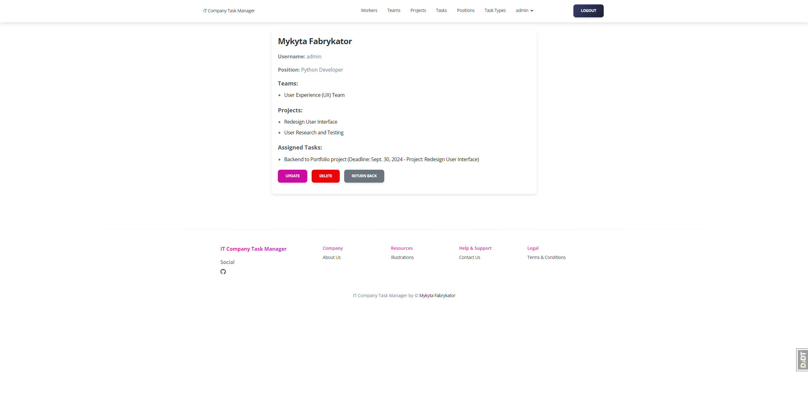

# IT Company Task Manager

This Task Management System, developed using Django, aims to streamline the organization of workers, teams, projects, and tasks in an IT company.
The system enables efficient assignment, monitoring, and management of tasks across various teams and projects, ensuring clear communication and progress tracking.

## Check it out!

[IT company task manager project deployed to render](https://it-company-task-manager-scrm.onrender.com/)

# Installation

Python3 must be already installed

```shell
git clone https://github.com/mykytafabrykator/it-company-task-manager.git
cd it-company-task-manager
python3 -m venv venv
source venv/bin/activate (on macOS)
venv/Scripts/activate (on Windows)
pip install -r requirements.txt
```

Create a `.env` file in the root directory of the project and copy the contents from `.env.sample`, replacing the placeholder values with your own:

```shell
cp .env.sample .env
```

You`re ready to start

```shell
python manage.py runserver
```

## Test User

* login: admin
* password: admin

## Features

* Authentication functionality for Worker/User
* Most views are secured with login access, ensuring only authorized users can view or modify content.
* Managing workers, teams, projects, tasks, positions and task types directly from website interface
* Custom forms allow users to search workers by username, teams and projects by name, and tasks by priority. This enhances the usability of the system by allowing quick access to relevant records.
* Users can view a list of all tasks assigned to them on the "My Tasks" page, making it easier to track personal responsibilities.
* Users can also view all projects they are part of on the "My Projects" page, giving a clear overview of the projects they are involved in.
* Removing a team from a project will also unassign its workers and delete associated tasks, ensuring no orphaned relationships remain.
* Clear error messages are displayed if a user tries to assign themselves to a task or toggle task completion without being part of the associated project.

## Models

The system includes the following core models:

* Worker: Represents an employee in the company. Each worker is associated with teams and can be assigned tasks within a project.
* Team: A collection of workers working on one or more projects.
* Project: A specific work initiative that teams are assigned to. Each project contains multiple tasks.
* Task: An individual work item within a project, assigned to one or more workers. Tasks can have different priorities and statuses.
* Position: Defines the role of a worker within the company (e.g., Developer, Manager, Tester).
* Task Type: Categorizes tasks (e.g., Development, Testing, Design), allowing clear classification.

## DB Structure


## Demo





